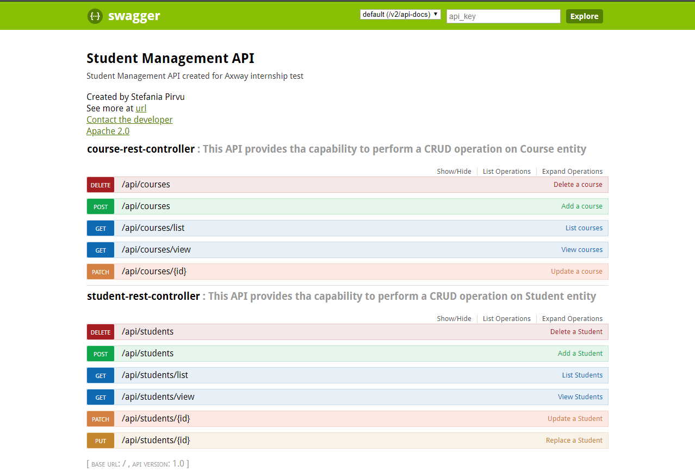
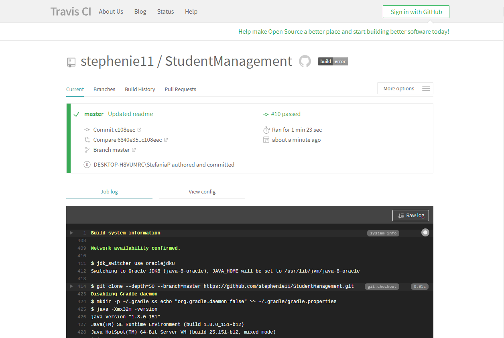
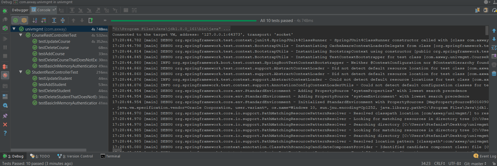

# Prerequisites and project setup

Project has been developed using Spring Boot as a Java Framework, Maven as build tool, Travis CI as Continous Integration, Swagger UI as rest documentation and specs,
MySQL as RDBMS. Make sure that port 8080 is not binded when you will test the application. You can test the REST functionallity via swagger UI.

```
http://localhost:8080/swagger-ui.html
```

REST API credentials ( used basic in memory authentication )

user:stefania
password:stefania

Create MySQL DB - univmgmt_db and be sure you can connect with root/root on it.


This is application properties content for connecting to MySQL database:

```
spring.datasource.url=jdbc:mysql://localhost:3306/univmgmt_db?useSSL=false
spring.datasource.username=root
spring.datasource.password=root
```

Install project

```
git clone https://github.com/stephenie11/StudentManagement.git

cd cd StudentManagement/

mvn clean install

mvn spring-boot:run

```

Go to ```http://localhost:8080/swagger-ui.html``` and type user stefania and password stefania in order to have access to the API and test the API.

### Swagger UI API documentation routes



### Student operations

### Course operations

### Continous Integration

Travis CI URL 

```
    https://travis-ci.org/stephenie11/StudentManagement
```



### Tests 

Implemented 10 tests

